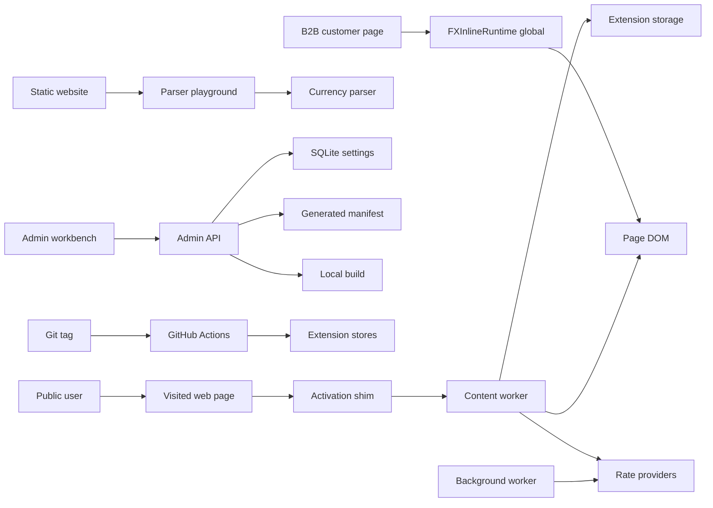

## Executive summary

FX Inline's main security exposure is the browser-extension boundary: a content script is eligible for all URLs, inspects page DOM text, dynamically loads a web-accessible worker, mutates page text with conversion wrappers, stores user settings/rate cache in extension local storage, and fetches exchange rates from third-party providers. The highest-priority risks are integrity and availability failures at those boundaries: public pages driving expensive DOM work, third-party or cached rate data causing misleading conversions, a non-loopback admin API triggering local builds or overwriting generated settings, and a future B2B script-runtime path shipping powerful page-mutating code without signed configuration and host scoping. CI/release secrets are also material because final tags publish store artifacts.

## Scope and assumptions

In-scope paths:
- `apps/extension/` runtime entrypoints, popup/options/welcome UI, storage, rates, and WXT manifest generation.
- `packages/currency-detection/` parser package and `packages/inline-runtime/` DOM conversion/runtime package.
- `apps/website/` marketing site and parser playground, including the current B2B positioning surface.
- `apps/backend/` and `apps/admin/` local settings workbench and generated manifest export.
- `.github/workflows/` and `scripts/release/` release/build/publish tooling.
- Planned B2B/script-runtime expansion only to the extent represented by current repo evidence: `FXInlineRuntime.mount()` global runtime, B2B sales copy, and the absence of active-checkout signed-manifest/allowlist/Clerk artifacts.

Out-of-scope items:
- `LikeC4/`, `NEW_WEB_EXTENSION_PROMPT.md`, graph/Graphify outputs, generated graph artifacts, generated build output, `dist`, `.output`, `test-dist`, previous revenue-review reports/data, and tests as primary product evidence.
- Browser, store, and exchange-rate provider infrastructure internals.
- A hosted Clerk dashboard/control plane as an implemented component, because it is not present in this active checkout.

Explicit assumptions:
- Public extension users install the Chrome/Firefox/Edge extension and browse arbitrary public `http`/`https` sites.
- Internal developers may run `npm run admin:api`; the user confirmed `FX_INLINE_ADMIN_API_HOST` may be non-loopback, so admin API exposure is modeled as a real risk.
- B2B/script-runtime scope includes the current browser-global runtime and website positioning, but signed manifests, host allowlists, integrity checks, and Clerk-backed control-plane authorization are required future controls rather than existing active-checkout controls.
- The extension is privacy-light: no account/session runtime was found in active extension code; rate fetches are the intentional network calls.
- CI/release jobs use GitHub Actions secrets for store publishing; those secrets are assumed to be configured only in trusted repo environments.

Open questions that would materially change risk ranking:
- Will the B2B script runtime be served from this repo's website, from a CDN, or from a customer-hosted bundle?
- Will B2B settings be configured by signed static manifests, an authenticated API, or manual customer-side config?
- If the admin API is run on a LAN/public interface, who is supposed to authenticate to it and from which origins?

## System model

### Primary components

- Browser extension manifest and permissions: WXT config declares `storage`, `alarms`, `activeTab`, two exchange-rate host permissions, `<all_urls>` web-accessible resources, and extension-page CSP. Evidence: `wxt.config.ts` `manifest`, `permissions`, `host_permissions`, `web_accessible_resources`, `content_security_policy`.
- Content activation shim: the content script matches `<all_urls>`, supports only `http:`/`https:`, scans bounded page text/mutations/selection for currency signals, and dynamically imports `content-worker.js`. Evidence: `apps/extension/entrypoints/content/index.tsx` `matches`; `apps/extension/entrypoints/content/contentActivation.ts` `SUPPORTED_CONTENT_PROTOCOLS`, `DEFAULT_SCAN_TEXT_NODE_LIMIT`, `importContentWorker`, `loadWorker`.
- Content worker and shared runtime adapter: once active, the worker watches `browser.storage.local`, observes page mutations, parses selected text, and delegates conversion to `@fx-inline/inline-runtime`. Evidence: `apps/extension/entrypoints/content/contentWorker.ts` `watchLocalStorageValue`, `MutationObserver`, `showSelectionPopupFromCurrentSelection`; `apps/extension/entrypoints/content/conversionRuntime.ts` `createInlineRuntime`.
- Shared inline runtime: scans text nodes, skips editable/non-visible/blocked contexts, creates DOM nodes/text nodes instead of HTML strings, and optionally auto-fetches rates when used as a standalone script runtime. Evidence: `packages/inline-runtime/src/core/textNodeDecorator.js` `decoratePricesInTextNode`; `packages/inline-runtime/src/core/conversionNodes.js` `setInlineConversionContent`; `packages/inline-runtime/src/core/domGuards.js` `shouldSkipTextNode`; `packages/inline-runtime/src/runtime/controllerFactory.js` `autoFetchRates`.
- Currency parser package: recognizes currency tokens, values, ranges, and locale/magnitude hints; used by extension and playground. Evidence: `packages/currency-detection/src/parser-core.js` `createCurrencyParser`, `extractMatches`.
- Rate provider client and cache: extension fetches two fixed USD rate endpoints, disables credentials/referrer, rejects redirects, validates numeric positive rates, and falls back to validated cache. Evidence: `apps/extension/utils/rates/providers.ts` `RATE_PROVIDERS`; `apps/extension/utils/rates/http.ts` `fetchRateProviderPayload`; `apps/extension/utils/rates/validation.ts` `normalizeRates`, `isValidSnapshot`; `apps/extension/utils/rates/index.ts` `getRates`.
- Extension local storage: user settings and rate cache are read/written through `browser.storage.local`; settings are sanitized and normalized before use. Evidence: `apps/extension/utils/appStorage.ts` `sanitizeUserSettings`, `getUserSettings`; `apps/extension/utils/inlineRuntimeSettings.ts` `sanitizeInlineRuntimeSettingsManifest`.
- Static website and playground: website advertises a B2B pricing-page pilot and playground parses user-provided text locally with a 5,000-character cap and control-character stripping. Evidence: `apps/website/index.html` "B2B pilot"; `apps/website/playground.html` CSP and input cap copy; `apps/website/playground.js` `MAX_INPUT_LENGTH`, `normalizeInput`.
- Local admin API/workbench: NestJS API reads/saves settings, writes SQLite and generated TypeScript manifest, and has a build endpoint that runs `npm run build`. It defaults to loopback but accepts `FX_INLINE_ADMIN_API_HOST`. Evidence: `apps/backend/src/main.ts` `DEFAULT_HOST`, `FX_INLINE_ADMIN_API_HOST`; `apps/backend/src/admin.controller.ts` `GET /api/settings`, `PUT /api/settings`, `POST /api/build-extension`; `apps/backend/src/admin.service.ts` `buildWebExtension`; `apps/backend/src/settings-store.ts` `writeGeneratedManifestFile`.
- CI/release pipeline: tag-triggered release workflow builds artifacts, uploads release assets, creates GitHub releases, and publishes final releases to Chrome, Firefox, and Edge using GitHub Actions secrets. Evidence: `.github/workflows/release.yml` `on.push.tags`, `permissions`, `AMO_JWT_*`, `CWS_*`, `EDGE_*`.
- B2B/script-runtime current surface: `packages/inline-runtime/src/global.js` exports `window.FXInlineRuntime.mount(options)`, and the website positions a B2B pricing-page pilot. No active-checkout signed manifest, host allowlist, runtime integrity, or Clerk control-plane files were found under the configured ignore rules.

### Data flows and trust boundaries

- Public web page -> content activation shim: page URL, DOM text, mutation records, and selected text cross from untrusted host page into the extension content-script context over browser content-script APIs. Existing controls: `http`/`https` protocol filter, skipped tags, 15,000 text-node and 20,000-character activation caps, debounced mutation scan. Evidence: `contentActivation.ts` `isSupportedContentScriptUrl`, `scanRootForCurrencyActivationSignal`, `ACTIVATION_MUTATION_DEBOUNCE_MS`.
- Activation shim -> web-accessible worker: currency signal starts dynamic import of `content-worker.js` from extension resources. Existing controls: `browser.runtime.getURL`/`chrome.runtime.getURL` resource resolution and `use_dynamic_url`; gap: resource is still web-accessible to all URLs by manifest. Evidence: `contentActivation.ts` `importContentWorker`; `wxt.config.ts` `web_accessible_resources`.
- Content worker -> page DOM: parsed currency matches and conversion results are inserted into the host page DOM. Existing controls: DOM APIs (`createElement`, `createTextNode`, `textContent`, `replaceWith`) instead of unsafe HTML injection, editable/hidden/self-wrapper skip rules, mutation suppression. Evidence: `textNodeDecorator.js` `decoratePricesInTextNode`; `conversionNodes.js` `setInlineConversionContent`; `domGuards.js` `shouldSkipTextNode`.
- Content worker -> extension storage: settings and cached rates cross into `browser.storage.local`. Existing controls: schema version, known currency/position/display/color validation, domain/page URL normalization, JSON-value filtering for extra settings. Evidence: `appStorage.ts` `sanitizeUserSettings`; `inlineRuntimeSettings.ts` `sanitizeInlineRuntimeSettingsManifest`.
- Background/content runtime -> exchange-rate providers: HTTPS GET requests fetch public rates. Existing controls: fixed provider URLs, no credentials, no referrer, no store cache, redirect rejected, 8-second timeout, positive numeric rate validation, provider fallback, cached snapshot fallback. Evidence: `providers.ts` `RATE_PROVIDERS`; `http.ts` `credentials: "omit"`, `redirect: "error"`; `validation.ts` `normalizeRates`; `rates/index.ts` `getRates`.
- Public website visitor -> playground parser: user-entered text crosses into static client-side parser logic. Existing controls: static CSP, input `maxlength`, JS 5,000-character cap, control-character stripping, textContent rendering. Evidence: `playground.html` CSP meta; `playground.js` `MAX_INPUT_LENGTH`, `normalizeInput`, result list rendering.
- Admin workbench/browser -> admin API: local or non-loopback HTTP clients can read/write settings and trigger extension builds. Existing controls: 1 MB body limit, sanitizer before SQLite/write, default loopback binding. Gaps: no auth, CSRF/origin check, or rate limit; confirmed non-loopback mode increases risk. Evidence: `main.ts` `DEFAULT_HOST`, `MAX_BODY_BYTES`; `admin.controller.ts` routes; `admin.service.ts` `buildWebExtension`.
- Admin API -> filesystem/build process: saved settings are persisted to SQLite and exported as TypeScript; build endpoint spawns `npm run build` in repo root with inherited environment. Existing controls: settings sanitizer and fixed command/args. Gaps: remote trigger risk if API is non-loopback; inherited environment may include developer secrets. Evidence: `settings-store.ts` `writeInlineRuntimeSettingsManifestToDb`, `writeGeneratedManifestFile`; `admin.service.ts` `spawn`.
- Git tag -> release pipeline -> extension stores: tag pushes build artifacts and publish via store credentials. Existing controls: workflow `contents: read` by default, `contents: write` scoped to GitHub release job, tests/build before publish, secrets in environment only for publish jobs. Gaps: no explicit GitHub environments/manual approvals shown for final store publishing. Evidence: `.github/workflows/release.yml` `permissions`, `publish-chrome`, `publish-firefox`, `publish-edge`.
- Planned B2B customer page -> `FXInlineRuntime.mount`: customer page code would pass runtime options, root, rates/config, plugins, and render preferences into page-mutating runtime. Existing controls in current package: host-provided rates by default unless `autoFetchRates` is enabled; DOM-node insertion rules. Missing active-checkout controls: signed config, host allowlist, plugin artifact integrity, customer tenancy/auth, and runtime health telemetry. Evidence: `global.js` `FXInlineRuntime.mount`; `controllerFactory.js` `autoFetchRates`, `prePlugins`, `postPlugins`.

#### Diagram

## Assets and security objectives

| Asset | Why it matters | Security objective (C/I/A) |
| --- | --- | --- |
| Host page DOM and user browsing context | Extension runs on arbitrary public pages and mutates price text. | I/A |
| Extension code and manifest permissions | Determines page access, web-accessible resources, CSP, provider access, and store trust. | I/A |
| User settings (`user-settings`) | Controls target currency, enablement, and per-domain/page behavior. | I |
| Rate cache (`rate-cache`) and fetched provider rates | Drives displayed converted amounts; wrong rates can mislead users/customers. | I/A |
| Admin SQLite database and generated manifest | Feeds extension runtime settings into builds and local artifacts. | I |
| Developer workstation/process environment | Admin build endpoint inherits environment and can run local build commands. | C/I/A |
| Release artifacts and sources zip | Store-distributed code and review artifacts. | I |
| Store publishing credentials | Can publish malicious or broken extension releases. | C/I |
| B2B customer pricing-page config/runtime | Future customer-facing script can alter pricing-page display. | I/A |
| Public website/playground availability | Lead-gen/proof surface; low confidentiality but public brand risk. | A/I |

## Attacker model

### Capabilities

- A public website can control its DOM, text content, mutation rate, selection text, language metadata, and page layout while the extension is installed.
- A network or provider-side attacker who can affect exchange-rate provider responses or availability can influence fetched rate data within validation limits.
- A local network attacker or malicious site can reach the admin API if a developer binds it to a non-loopback host and no firewall blocks access.
- A malicious internal actor or compromised CI dependency can target release artifacts and store publishing paths.
- A B2B customer page, integrator, or compromised CDN can provide unsafe runtime options if the global runtime becomes a hosted script product without signed config and origin scoping.

### Non-capabilities

- Public pages cannot directly call privileged extension APIs such as `browser.storage.local` from the page JS context; the observed privileged calls are in extension contexts.
- The current extension runtime does not send browsing history or page content to an application backend in the active checkout.
- Website playground visitors do not upload data to a backend in the active checkout; parsing is client-side static JS.
- Attackers cannot use arbitrary provider URLs in the extension rate client because provider URLs are fixed in code.
- Clerk/dashboard compromise is not modeled as an implemented active-checkout risk because those files are absent from the current checkout.

## Entry points and attack surfaces

| Surface | How reached | Trust boundary | Notes | Evidence (repo path / symbol) |
| --- | --- | --- | --- | --- |
| `<all_urls>` content script activation | User visits any matching page | Page DOM -> extension content script | Activation is bounded and `http`/`https` only, but the page controls the scanned DOM and mutation cadence. | `apps/extension/entrypoints/content/index.tsx` `matches`; `contentActivation.ts` `SUPPORTED_CONTENT_PROTOCOLS` |
| Dynamic `content-worker.js` import | Currency signal in page text/mutations/selection | Extension resource -> content script | Reduces routine work but resource is web-accessible to all URLs. | `contentActivation.ts` `importContentWorker`; `wxt.config.ts` `web_accessible_resources` |
| Page mutation observer | Worker active on a page | Page DOM -> shared runtime | Page can generate many mutation roots; runtime has debounce/time budgets but still runs in user page context. | `contentWorker.ts` `MutationObserver`; `controllerFactory.js` `runPartialConversionPass` |
| Text-node conversion | Runtime parses/mutates DOM | Extension/runtime -> page DOM | Uses DOM construction rather than HTML injection. Integrity risk is wrong or misleading conversion, not obvious XSS. | `textNodeDecorator.js` `decoratePricesInTextNode`; `conversionNodes.js` `setInlineConversionContent` |
| Selection popup | User selection with price-like text | Page selection -> extension UI | Parses selected page text and renders Shadow DOM popup. | `contentWorker.ts` `showSelectionPopupFromCurrentSelection` |
| Extension storage settings | Popup/options/admin generated manifest and storage changes | Operator/user-controlled config -> extension runtime | Settings are sanitized, scoped, and normalized before runtime use. | `appStorage.ts` `sanitizeUserSettings`; `inlineRuntimeSettings.ts` `resolveInlineRuntimeSettingsForUrl` |
| Rate fetch | Install/startup/alarm/runtime refresh | Extension -> third-party HTTPS APIs | Fixed providers, no credentials/referrer, timeout, redirect rejection, response normalization. | `background.ts` `initializeRateRefresh`; `rates/http.ts` `fetchRateProviderPayload`; `rates/providers.ts` `RATE_PROVIDERS` |
| Static playground input | Visitor enters/pastes text | Browser UI -> parser | 5,000-character cap and control-character stripping; results rendered with `textContent`. | `playground.js` `MAX_INPUT_LENGTH`, `normalizeInput`, `runDetection` |
| Admin `GET /api/settings` | Admin workbench or HTTP client | HTTP client -> local API | No auth; lower risk on loopback, higher risk when non-loopback. | `admin.controller.ts` `getSettings`; `main.ts` `DEFAULT_HOST` |
| Admin `PUT /api/settings` | Admin workbench or HTTP client | HTTP client -> SQLite/generated manifest | Sanitizes before persistence/export, but no auth/CSRF/rate limits. | `admin.controller.ts` `saveSettings`; `settings-store.ts` `sanitizeInlineRuntimeSettingsManifest` |
| Admin `POST /api/build-extension` | Admin workbench or HTTP client | HTTP client -> local command execution | Fixed command but expensive and environment-bearing; high concern if network-exposed. | `admin.controller.ts` `buildExtension`; `admin.service.ts` `buildWebExtension` |
| Release tag workflow | Push tag `v*` | GitHub repo -> CI -> stores | Builds and publishes with store secrets for final releases. | `.github/workflows/release.yml` `on.push.tags`, `publish-*` jobs |
| B2B global runtime | Customer embeds script and calls mount | Customer page/config -> page-mutating runtime | Active package exposes a generic page-mutating API; signed config/allowlist controls are not in active checkout. | `packages/inline-runtime/src/global.js` `FXInlineRuntime.mount`; `apps/website/index.html` B2B pilot copy |

## Top abuse paths

1. Page-driven DOM DoS -> attacker-controlled page generates price-like text and mutation churn -> activation loads worker -> mutation observer and runtime repeatedly scan/convert bounded batches -> browser tab becomes slow or unusable.
2. Misleading conversion integrity -> exchange provider or network path returns plausible but manipulated rates -> validation accepts finite positive known-code rates -> extension displays incorrect conversion hints -> user or B2B customer makes pricing decisions from false estimates.
3. Non-loopback admin build trigger -> developer starts admin API on LAN/public interface -> remote attacker posts to `/api/build-extension` -> server runs `npm run build` with inherited environment -> local CPU, files, and secrets-adjacent environment are exposed to unnecessary risk.
4. Non-loopback settings overwrite -> remote attacker PUTs sanitized but malicious settings -> SQLite and generated manifest are overwritten -> next build/test consumes attacker-chosen scopes/currencies/display settings -> developer ships or demos wrong behavior.
5. Web-accessible worker fingerprinting/abuse -> arbitrary page requests extension web-accessible resources -> confirms extension presence and targets FX Inline users with page-specific mutation/content patterns -> privacy and availability impact.
6. Release pipeline compromise -> malicious dependency or compromised tag path reaches release workflow -> artifacts are built and final release jobs access store credentials -> attacker publishes compromised extension package.
7. B2B script-runtime config compromise -> future customer embeds generic `FXInlineRuntime` without signed manifests/host allowlists -> attacker alters runtime options, plugins, or rates -> customer pricing page shows manipulated or confusing local-currency hints.
8. Playground parser availability issue -> visitor pastes worst-case currency-like input under the cap -> parser and partial-match collector run in the browser -> static page becomes sluggish; confidentiality impact remains low because no backend upload exists.

## Threat model table

| Threat ID | Threat source | Prerequisites | Threat action | Impact | Impacted assets | Existing controls (evidence) | Gaps | Recommended mitigations | Detection ideas | Likelihood | Impact severity | Priority |
| --- | --- | --- | --- | --- | --- | --- | --- | --- | --- | --- | --- | --- |
| TM-001 | Malicious public page | User has extension installed and visits attacker-controlled `http`/`https` page. Page can control DOM size, text, selection, and mutation cadence. | Force activation and generate mutation/text workloads that repeatedly trigger conversion passes. | Tab-level slowdown, battery drain, possible user distrust or disablement. | Host page DOM, browser availability, extension reputation | Protocol filter, activation caps, skipped tags, mutation debounce, runtime max nodes/time budgets (`contentActivation.ts`, `controllerFactory.js`). | No per-origin backoff, no hard per-minute conversion budget, no user-visible "site disabled due to load" state. | Add per-origin activation/work budget with exponential backoff; persist temporary site disablement after repeated node-limit/time-budget hits; expose a per-site disable reason in popup/options. | Count node-limit hits, activation load reason, conversion duration p95, deferred root count per origin; log only locally unless telemetry is explicitly designed. | Medium: any page can trigger this, but work is bounded. | Medium: mostly availability/user trust, not data theft. | medium |
| TM-002 | Rate provider/network compromise or outage | Attacker can influence one provider response or cause one/both providers to fail. Values remain finite and positive enough to pass current validation. | Supply incorrect rates or force stale cache fallback. | Misleading conversions shown in extension and future B2B pricing-page hints. | Rate cache, user decisions, B2B customer pricing display | Fixed URLs, no credentials/referrer, redirect rejected, timeout, provider fallback, positive numeric known-code validation, cache validity checks (`rates/http.ts`, `rates/providers.ts`, `rates/validation.ts`, `rates/index.ts`). | No freshness maximum shown in `isValidSnapshot`; no cross-provider consistency check; no user-facing stale/error state in the threat evidence reviewed. | Add max cache age and fetched-at validation; compare primary/secondary provider deltas for target currencies; show stale/failed rate state in UI and suppress conversion if rates are too old. | Track provider failures, cache age on conversion, cross-provider deltas, and suppressions. | Medium: third-party outages are realistic; targeted provider compromise is less likely. | High: wrong rates directly undermine product integrity. | high |
| TM-003 | Malicious LAN/public client or malicious website reaching exposed admin API | Developer runs `FX_INLINE_ADMIN_API_HOST` on a non-loopback interface. No authentication, CSRF token, or origin check is present. | Call `POST /api/build-extension` repeatedly or call `PUT /api/settings` with attacker-chosen sanitized settings. | Local resource exhaustion, generated manifest tampering, build process run with developer environment. | Developer workstation, generated manifest, SQLite settings, local build integrity | Default host is `127.0.0.1`; 1 MB body limit; settings sanitizer; fixed `npm run build` command (`main.ts`, `settings-store.ts`, `admin.service.ts`). | Confirmed non-loopback use; no auth, authorization, CSRF/origin check, request logging, rate limit, or build endpoint guard. | Require explicit `FX_INLINE_ADMIN_API_ALLOW_REMOTE=1` for non-loopback; add bearer token or local random session token; reject browser cross-origin requests unless allowed; disable build endpoint unless local and authenticated; add rate limits. | Log remote address, route, status, build invocations, and settings writes; alert on non-loopback startup and repeated build calls. | High if non-loopback is used; low on loopback only. User confirmed non-loopback is possible. | High: local command trigger and persistent settings tampering. | high |
| TM-004 | Malicious page probing web-accessible resources | User has extension installed and visits attacker-controlled page. Manifest exposes worker/chunks/theme to `<all_urls>` with dynamic URL. | Probe resources to fingerprint extension and tailor DOM abuse or social engineering. | Extension presence privacy leak and targeted page behavior. | User privacy, extension availability | `use_dynamic_url: true`; limited resource names (`wxt.config.ts` `web_accessible_resources`). | Resource exposure still broad; content-worker is intentionally available to all URLs. | Keep activation shim as small as possible; verify whether WXT can narrow resources or dynamic URL behavior further; document accepted fingerprinting residual risk; avoid adding more WAR assets. | Manual WAR inventory in build assertions; store review of emitted manifest on release. | Medium: extension fingerprinting is common. | Low to medium: mostly privacy/targeting unless combined with TM-001. | medium |
| TM-005 | Malicious page content causing DOM injection or UI interference | Extension worker is active on an attacker-controlled page. Page controls text nodes and layout. | Attempt to turn price text into executable markup or interfere with selection popup events. | XSS risk appears low; UI interference or misleading display remains possible. | Host page DOM integrity, user trust | Conversion uses `createElement`, `createTextNode`, `textContent`, `replaceWith`; skips editable/hidden/self-wrapper contexts; popup events scoped to extension UI (`textNodeDecorator.js`, `conversionNodes.js`, `domGuards.js`, `contentWorker.ts`). | No Trusted Types policy because code avoids HTML injection; visual spoofing by host page remains possible. | Maintain a no-HTML-insertion invariant with tests/grep guardrails; keep popup in Shadow DOM; add regression checks for new renderer plugins and tooltip/title behavior. | Static check for `innerHTML`/`insertAdjacentHTML` in runtime; content tests around malicious text and plugin output. | Low: current controls are strong for XSS. | Medium: any regression would affect arbitrary pages. | medium |
| TM-006 | CI/release pipeline attacker | Attacker gets code into a tagged release path or compromises dependencies/actions. | Build and publish modified extension artifacts using store secrets. | Store-distributed compromise, user trust loss, credential misuse. | Release artifacts, store credentials, extension users | Default workflow `contents: read`, tests/build before publish, store secrets scoped to publish jobs, GitHub release job has `contents: write` only (`release.yml`). | No explicit protected environments/manual approvals in the workflow; `npm ci` executes dependency lifecycle scripts; final tag push starts publishing. | Put store publish jobs behind GitHub environments with required reviewers; protect `v*` tags; pin or audit third-party actions; consider `npm ci --ignore-scripts` where feasible with explicit required scripts restored. | Monitor tag creation, release job actor, artifact hashes, store publish responses, and secret access events. | Low to medium depending on repo/tag protection. | High: compromised extension release is severe. | high |
| TM-007 | B2B customer page, compromised CDN, or integrator mistake | Future B2B runtime is embedded on customer pricing pages using generic `FXInlineRuntime.mount(options)`. Active checkout lacks signed manifest/host allowlist/control-plane files. | Alter options/rates/plugins or load runtime on unauthorized hosts. | Customer pricing pages show wrong local hints; cross-customer config bleed if a future control plane is added poorly. | B2B customer pricing display, runtime config, brand trust | Current global runtime exists; it defaults to host-provided rates unless `autoFetchRates` is enabled and still uses DOM-safe renderers (`global.js`, `controllerFactory.js`). | No active signed manifest, host allowlist, tenant auth, config schema envelope, plugin artifact integrity, or kill switch in active checkout. | Before shipping B2B: require signed manifest envelopes with key rotation, host allowlist, config schema validation, SRI or immutable versioned loader, plugin artifact hashes, kill switch, per-client rate limits, and explicit customer preview/approval. | Runtime health pings without page content, config signature failures, host mismatch events, version adoption, conversion counts, and customer-side error budgets. | Medium if B2B ships without controls; currently planned/partial. | High: customer pricing integrity and trust. | high |
| TM-008 | Static website visitor or malicious paste payload | Visitor opens playground and enters crafted input up to 5,000 characters. | Exercise parser and partial-match paths to freeze the page or misrepresent parser capability. | Local browser slowdown; no server-side data exposure in active checkout. | Website availability, proof surface integrity | Static CSP, input cap, control-character stripping, `textContent` result rendering (`playground.html`, `playground.js`). | No web worker/off-main-thread parsing; no runtime timeout around detection. | Move playground parsing to a Web Worker if demos must handle worst-case inputs; add timing guard and visible failure state. | Browser performance marks for detect duration in local QA; synthetic worst-case parser benchmark. | Low to medium: bounded to the visitor's browser. | Low: no backend or sensitive data. | low |

## Criticality calibration

- Critical: direct arbitrary code execution in extension privileged context, bypass that lets a web page read/write `browser.storage.local`, or unauthorized store publishing with active user impact. Examples: page-controlled HTML/script execution inside extension pages; release job publishes attacker artifact to stores; future B2B control plane leaks one customer config to another.
- High: integrity compromise of user-visible pricing or local developer build environment with realistic reach. Examples: non-loopback admin API allows remote build trigger/settings tampering; manipulated exchange rates are accepted and displayed; unsigned B2B runtime config alters customer pricing hints.
- Medium: bounded availability/privacy issues or security regressions requiring user navigation to a malicious page. Examples: page-driven DOM churn slows a tab; web-accessible resources fingerprint installed extension; renderer regression permits misleading but non-executable DOM output.
- Low: isolated static-site or local-only issues with limited sensitivity. Examples: playground freezes only the visitor's tab; public marketing metadata placeholders; noisy provider failure that falls back safely and clearly.

## Focus paths for security review

| Path | Why it matters | Related Threat IDs |
| --- | --- | --- |
| `wxt.config.ts` | Defines extension permissions, host permissions, CSP, and web-accessible resource exposure. | TM-001, TM-004, TM-006 |
| `apps/extension/entrypoints/content/index.tsx` | All-URLs content script registration. | TM-001, TM-004 |
| `apps/extension/entrypoints/content/contentActivation.ts` | First boundary from untrusted page DOM into extension runtime; contains activation caps and dynamic worker load. | TM-001, TM-004 |
| `apps/extension/entrypoints/content/contentWorker.ts` | Runs mutation observer, storage watch, selection popup, and conversion runtime wiring. | TM-001, TM-005 |
| `apps/extension/entrypoints/content/conversionRuntime.ts` | Applies settings/rates to shared runtime and handles storage update refresh. | TM-001, TM-002 |
| `packages/inline-runtime/src/core/textNodeDecorator.js` | Core DOM rewrite path for price text. | TM-005, TM-007 |
| `packages/inline-runtime/src/core/conversionNodes.js` | Wrapper content creation, tooltip/title rendering, suppression/refresh behavior. | TM-005, TM-007 |
| `packages/inline-runtime/src/runtime/controllerFactory.js` | Standalone runtime control surface, mutation scheduling, auto-fetch option, plugin hooks. | TM-001, TM-007 |
| `packages/inline-runtime/src/global.js` | Browser-global B2B/script-runtime API entry point. | TM-007 |
| `packages/currency-detection/src/parser-core.js` | Parser complexity and match behavior drive extension, playground, and future B2B conversion accuracy. | TM-001, TM-008 |
| `apps/extension/utils/rates/http.ts` | Network hardening for exchange-rate fetches. | TM-002 |
| `apps/extension/utils/rates/providers.ts` | Fixed provider order and parsing boundary. | TM-002 |
| `apps/extension/utils/rates/validation.ts` | Determines which external/cached rate snapshots are trusted. | TM-002 |
| `apps/extension/utils/inlineRuntimeSettings.ts` | Runtime settings schema, normalization, and per-page/domain/all-URLs precedence. | TM-003, TM-007 |
| `apps/extension/utils/appStorage.ts` | Extension local storage read/write and legacy migration. | TM-003 |
| `apps/backend/src/main.ts` | Admin API bind address and body limit. | TM-003 |
| `apps/backend/src/admin.controller.ts` | Admin HTTP routes, including unauthenticated build endpoint. | TM-003 |
| `apps/backend/src/admin.service.ts` | Spawns `npm run build` with inherited environment. | TM-003 |
| `apps/backend/src/settings-store.ts` | SQLite persistence and generated TypeScript manifest export. | TM-003 |
| `apps/website/playground.js` | Public parser demo input normalization and main-thread parsing. | TM-008 |
| `apps/website/index.html` | Public B2B positioning creates expectations for script-runtime security controls. | TM-007 |
| `.github/workflows/release.yml` | Store publishing pipeline and secret exposure boundary. | TM-006 |
| `scripts/release/publish-chrome.mjs` | Chrome Web Store API token/signing flow. | TM-006 |
| `scripts/release/publish-edge.mjs` | Edge Add-ons publish API key usage. | TM-006 |
| `scripts/release/build-artifacts.mjs` | Release artifact assembly and signing path. | TM-006 |

## Notes on use

- This report intentionally separates active-checkout controls from planned B2B controls. The active repo contains a browser-global runtime and B2B sales page, but not signed manifest, host allowlist, or Clerk/dashboard implementation files.
- Tests were not used as primary architecture evidence, but they should be used to lock any mitigation that changes runtime behavior.
- Generated settings files and admin SQLite data are ignored local artifacts; their integrity still matters because build/compile/test paths regenerate and consume them.
- Re-rank TM-003 if the admin API is guaranteed loopback-only in future; re-rank TM-007 upward when a hosted B2B runtime or control plane lands.

## Quality check

- Covered discovered entry points: content script activation, dynamic worker import, mutation observer, selection popup, storage, rate fetch, website playground, admin API routes, local build trigger, release workflow, B2B global runtime.
- Represented each trust boundary in at least one threat: page->extension, extension->page DOM, extension->storage, extension->rate providers, admin client->API, API->filesystem/build, tag->CI/stores, customer page->global runtime.
- Separated runtime behavior from CI/build/dev tooling and from static website/playground surfaces.
- Reflected user clarifications: B2B/script-runtime included, non-loopback admin API treated as real, and risk calibrated for public users plus internal development.
- Assumptions and open questions are explicit, especially around future B2B hosting/control-plane design.
